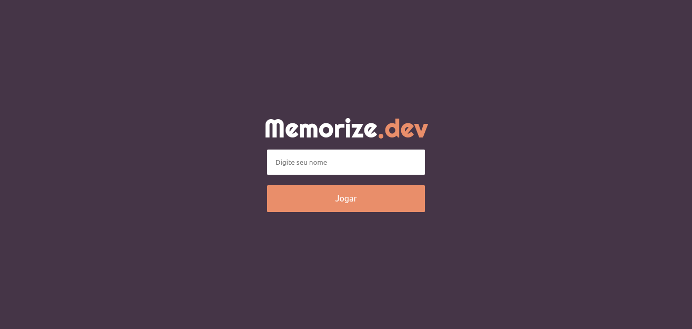
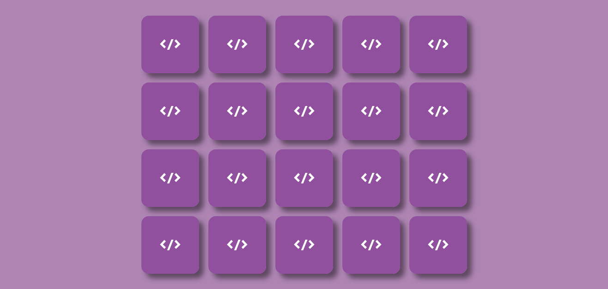
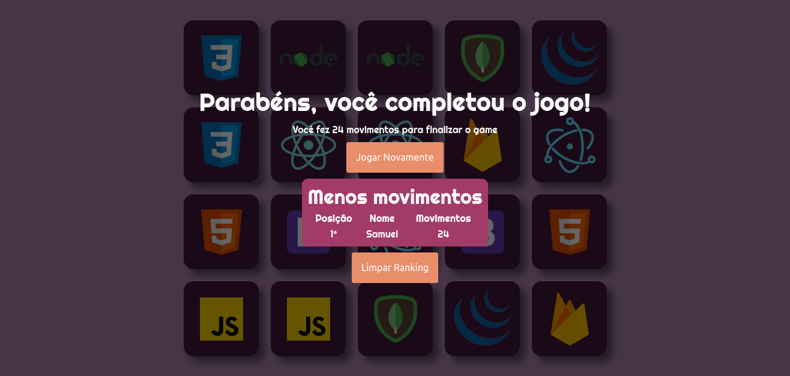
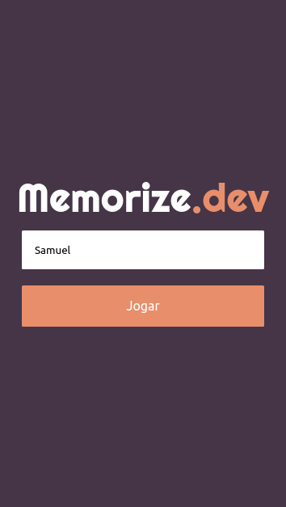
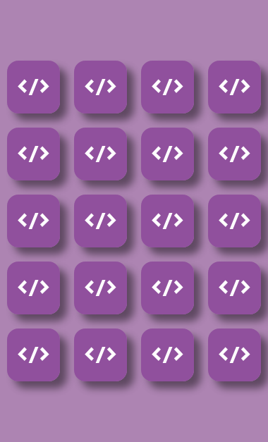
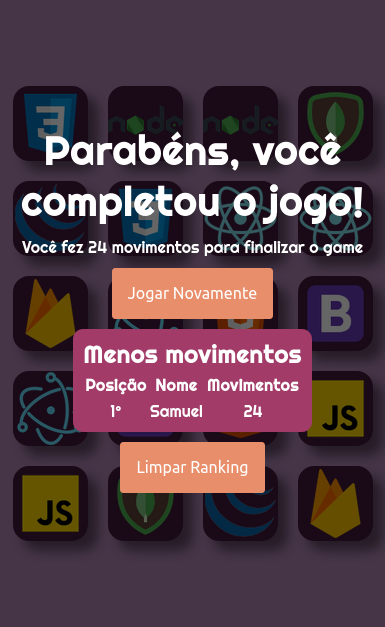

# Memorize.dev

## Resumo do Projeto

O [Memorize]() é um jogo que usa como base o jogo da memória do progBr.

## 🔨 Funcionalidades
O jogo tem algumas alterações em relação ao jogo original, essas 
alterações são:

- Responsividade.
- Paleta de cores diferente(apenas design 😉).
- Através do LocalStorage, salva o nome e a quantidade de movimentos que o jogador precisou para terminar a partida.
- Mostra um Ranking com os 5 melhores jogadores.

## ✔️ Técnicas e tecnologias utilizadas

- ``HTML``
- ``CSS``
- ``Javascript``

## Desktop

___

### Tela Inicial

### Tabuleiro

### Tela Final

## Mobile

___

### Tela Inicial

### Tabuleiro

### Tela Final

